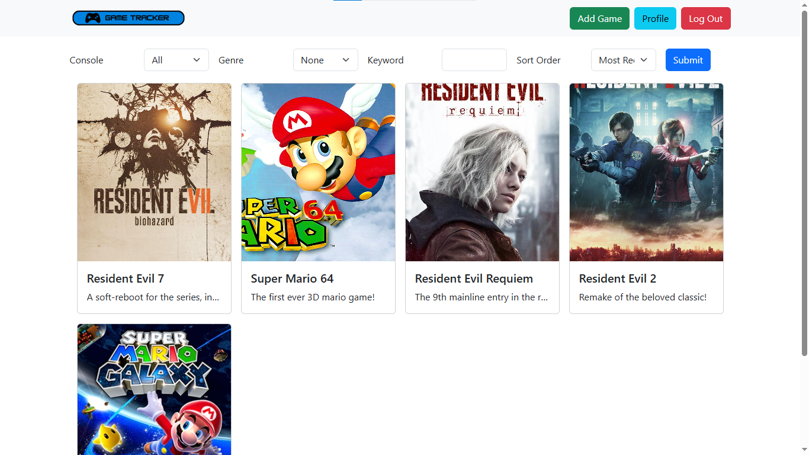
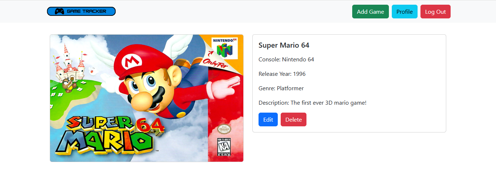

# Game-Tracker

Link to website: [https://game-tracker-qoxu.onrender.com/](https://game-tracker-qoxu.onrender.com/)

Backend Documentation: [API.md](API.md)

This project is a web application that lets users create accounts and keep track and organize their videogames from across multiple platforms. This project was designed using a django REST framework backend and a React.js frontend. I was able to successfully deploy this project to the web using Render, Neon, and Cloudinary for the frontend, backend, and image storage respectfully. Below you will find descriptions of its features as well as instructions on how to run locally.

## Screen Shots

### Home Page

### Game Detail Page

## Features

### Backend
The backend comprises of two main models, the accounts and games. Accounts are based off of django base user model but customized slightly to only require an email and password. I also created api endpoints to allow users to create and edit accounts. The login system was implemented using token authentication, allowing for a stateless api. To ensure online user safety, all passwords are hashed using django's authentication system and are not viewable otherwise. Security was implemented to ensure only a logged in user may view their own games to maintain user privacy. Lastly, a users' credentials may be updated anytime through the api if they so choose.

The games model was designed to represent a video game a user may own by keeping track of all of its neccessary attributes. This includes its title, console, genre, release date, and descprition. Each game is associated with the currently logged in user and is therefore only visible to that user. Furthermore, a user's game list can be filterd by console, genre, or keyword and the ordering can be adjusted to rearrange by release date, most recently added, and title.

### Frontend
The frontend was developed using react.js to create a fast and responsive user experience. Notably, react router was used to prevent page reloads when traversing the web app maintain a fast and responsive experience. Furthermore, all of the buttons and icons were made using Bootstrap to create a simplistic yet visually appealing user interface. The frontend is currently hosted on Render using their free tier plan. This allows anyone in the world to access this project by simply creating an account and logging in. Users can easily add and edit the games they own using the frontend's user interface, as it is directly connected to my database stored on Neon. If users so choose, they could also instead download and run my application locally, keeping their game collection offline and storing their games on their local machine. Lastly, users can update their user profile anytime through the frontend and are able to modify their email and password as they so choose.

## Instructions to Run Locally
Both my frontend and backend can be run separately. Below I will give instructions for each and their various options. You may optionally set up a virtual environment to prevent dependancy conflicts.
Also, ensure you have `python` installed, ideally a version above or equal to `3.14.2`, and an up to date version of `pip`, as these will be needed to install the backend.

### Backend
First, in your terminal run `cd/backend/gametracker` to chande the directory into the backend.
Next, run `pip install -r requirements.txt` to install all of the required packages.
Next, run `python manage.py migrate` to set up the database.
Lastly, run `python manage.py runserver` to turn on the database.
From now on, you will only need to run `python manage.py runserver` in order to turn on the database.

### Frontend
Before doing anything, you need to make one small modification to the frontend to ensure api requests are sent to your local machine instead of the online database.
Open the file `.env` located in `frontend/gametracker` and notice the two lines. The first one is the url for the online database and the second is for the local database on your machine. Simply comment out the first line and uncomment the second to switch to your local machine's database.

To now set up the frontend locally, you need to first open a new terminal on your machine and run the following commands.

First, in your new terminal run `cd/frontend/gametracker` to change directictory into the frontend.
Next, run `npm install` to install the necessary packages.
Lastly, run `npm start` to start up your frontend.
The web page should open automatically, but in case it doesn't, it should be viewable at 
http://localhost:3000

With both the backend and frontend running at the same time, you should now be able to fully access the project on your local machine.
